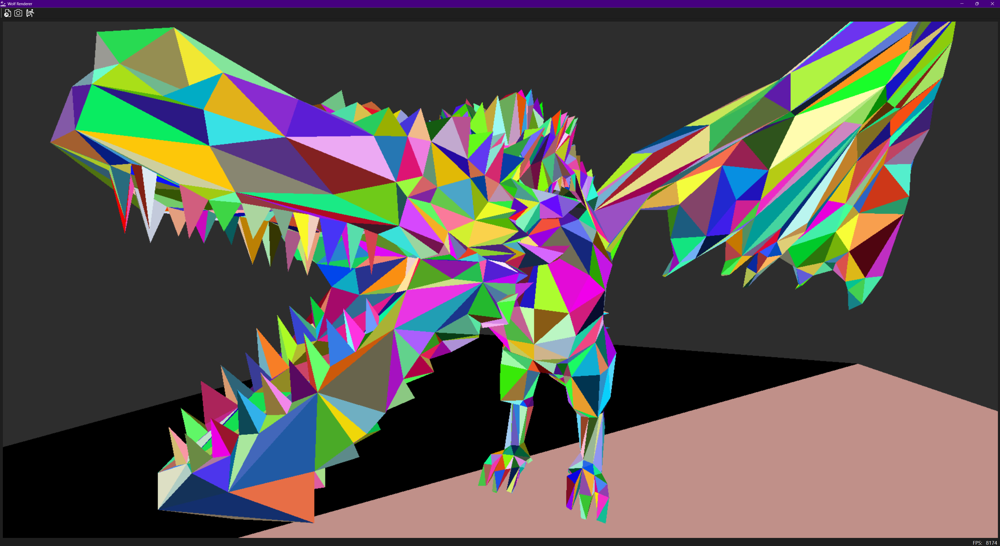
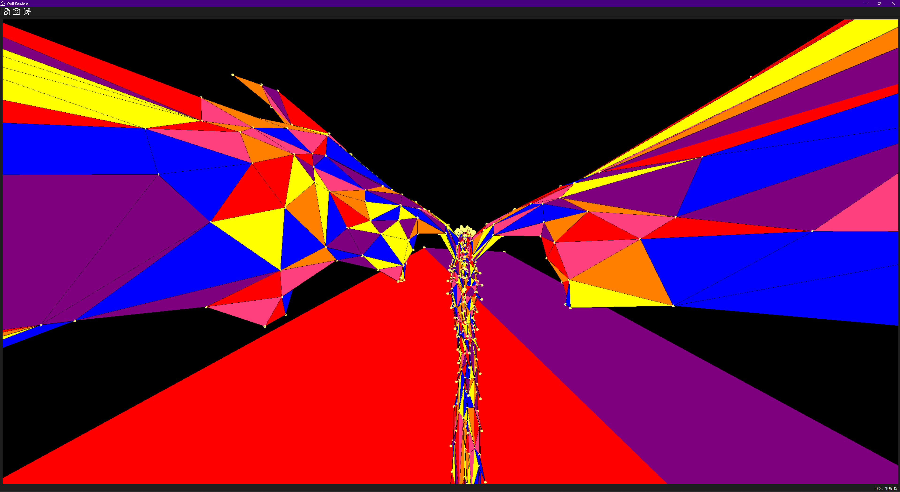
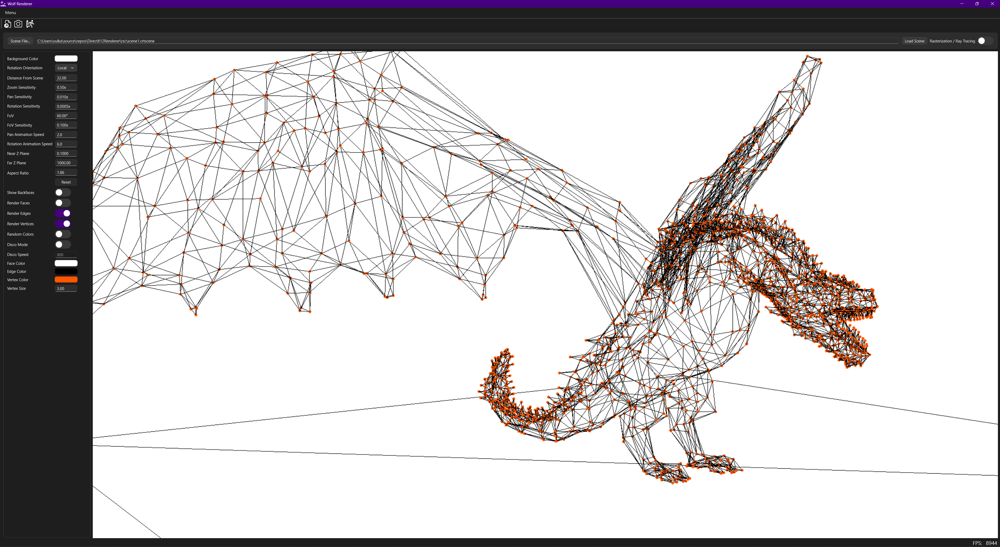
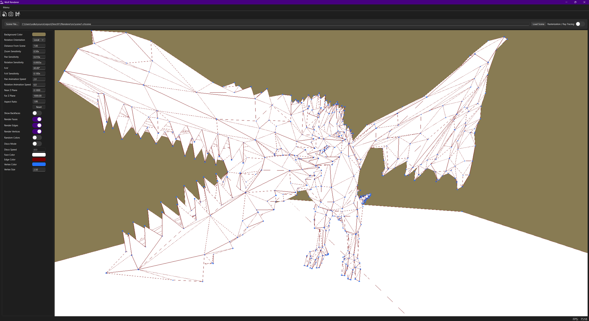
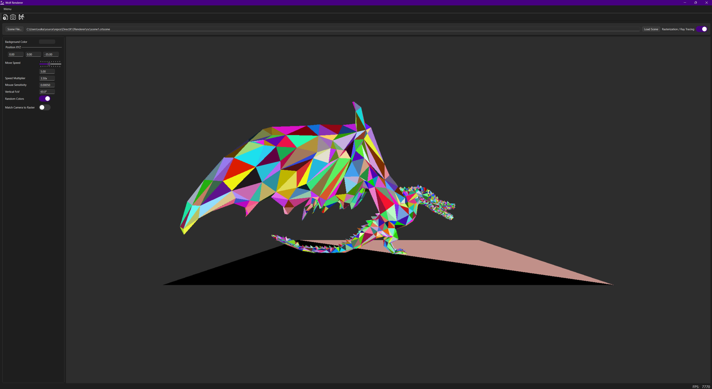

# DirectX12Renderer

A Windows-based real-time rendering application implementing both **rasterization** and **ray tracing** pipelines using DirectX 12. The project features a Qt-based GUI with an interactive viewport that can dynamically switch between rendering modes at runtime.

## [[ IMPORTANT ]]
If you have any issues building and running the application, you can try it out by downloading the files from the **Release** section here on GitHub!

## Showcase
### Screenshots

<p float="left">
  
  
</p>
<p float="left">
  
  
</p>

### Video (Outdated)
[](https://youtu.be/sAdg-p7nPXE)


## 📋 Table of Contents
- [Overview](#-overview)
- [Features](#-features)
- [Architecture](#architecture)
- [Requirements](#-requirements)
- [Building](#-building)
- [Usage](#-usage)
- [Project Structure](#-project-structure)
- [Technical Details](#-technical-details)
- [License](#-license)

## 🔭 Keyboard shortcuts
- **Ray Tracing**
  - Right Mouse Button (**RMB**) click + mouse drag: Rotate the camera (look around).
  - Right Mouse Button (**RMB**) click + **W**, **S**, **Up**, **Down**: Move around the scene in the Z axis.
  - Right Mouse Button (**RMB**) click + **A**, **D**, **Left**, **Right**: Move around the scene in the X axis.
  - Right Mouse Button (**RMB**) click + **Q**, **E**, **PageUp**, **PageDown**: Move around the scene in the Y axis.
  - Right Mouse Button (**RMB**) click + **Shift** + movement: Faster movement in all axes.
  - Right Mouse Button (**RMB**) click + mouse scroll up/down: Change movement speed multiplier.
- **Rasterization**
  - Left Mouse Button (**LMB**) click + mouse drag: Move geometry along the 2D screen with
    smooth animation to reach the target destination.
  - Right Mouse Button (**RMB**) click + mouse drag: Rotate geometry along the world X and Y axes with
    smooth animation to reach the target destination.
  - Middle Mouse Button (**MMB**) scroll: Zoom camera in/out.
  - Middle Mouse Button (**MMB**) click + mouse drag up/down: Change camera Field Of View (FOV) angle.
- **General**
  - Mouse **`Double Click`** / Keyboard **`F`**: Toggle Fullscreen.

## ✨ Features

### WolfRenderer Library (DirectX 12 Core)

#### Rendering Modes
- **Dual Rendering Pipeline**: Seamlessly switch between rasterization and ray tracing at runtime.
- **Scene Reloading at Runtime**: Pick and load a different scene to render without closing the application.
- **Rasterization Controls**: Real-time camera panning support via mouse interaction.
- **Ray Tracing Pipeline (DXR) Controls**: Real-time camera panning + WSAD+QE movement support via mouse and keyboard interaction.
- **Ray Tracing Camera Coordinates Switch**: Switch for the ray tracing camera's coordinate system to mimic the projection matrix of the one used in rasterization mode.

#### DirectX 12 Infrastructure
- **Device Management**
  - Automatic GPU adapter selection (skips software adapters).
  - Multi-adapter detection with hardware ID filtering.
  - Dedicated video memory reporting.
  - Debug layer support for development builds.
  
- **Command Management**
  - Command queue, allocator, and list orchestration.
  - Efficient command buffer reuse per frame.
  - Resource state transitions with barriers.
  
- **Memory Management**
  - Upload heap staging for CPU-to-GPU data transfers.
  - Default heap for GPU-optimal resource storage.
  - Proper synchronization to prevent resource hazards.
  
- **Synchronization**
  - Fence-based GPU-CPU synchronization.
  - Event-driven frame completion detection.
  - Safe resource cleanup on application exit.
  
- **Swap Chain**
  - Configurable buffer count (double/triple buffering).
  - FLIP presentation model (DXGI_SWAP_EFFECT_FLIP_DISCARD).
  - R8G8B8A8_UNORM format rendering.
  - Render target view (RTV) descriptor heap management.

#### Shader Compilation
- **Runtime Shader Compilation**
  - DirectX Shader Compiler (DXC) integration.
  - Runtime HLSL compilation for ray tracing shaders.
  - Random primitive coloring computed in-shader.
  - Debug information embedding for shader debugging.
  - Detailed compilation error reporting.
  
- **Build-Time Compilation**
  - Pre-compiled rasterization shaders embedded as headers.
  - Shader library profiles: `lib_6_5` (ray tracing), `vs_6_8` / `ps_6_8` (rasterization).

#### Logging System
- **Thread-Safe Logger**
  - Mutex-protected output stream.
  - Configurable log levels (Debug, Info, Warning, Error, Critical).
  - Timestamped log entries (DD.MM.YYYY HH:MM:SS format).
  - Build-dependent default levels (Debug: all, Release: Info+).
  - HRESULT error checking with automatic logging and termination.

#### Geometry Support
- 3D vertices for both rasterization and ray tracing (X, Y, Z coordinates).
- Dynamic geometry loading from `.crtscene` file (`JSON`).
- Triangle primitive topology.
- Vertex buffer view configuration.

### WolfApp GUI Application

#### User Interface
- **Modern Qt 6.10.1 Interface**
  - Responsive window with grid layout.
  - Custom viewport widget with native window handle for DirectX.
  - System accent color integration for theme consistency.
  - Menu bar with keyboard shortcuts.
  - Automatic aspect ratio correction based on window size.
  
- **Rendering Mode Toggle**
  - Visual toggle switch (Rasterization ↔ Ray Tracing).
  - Smooth transition between modes with GPU synchronization.
  - Keyboard shortcut via menu action.
  - Real-time mode indicator in UI.
  
- **Performance Monitoring**
  - Real-time FPS (Frames Per Second) counter.
  - Status bar display with custom styling.
  - 1-second update interval for accurate measurement.
  
- **Interactive Viewport**
  - Native window handle (HWND) for DirectX rendering.
  - Controls using mouse and keyboard.
  - Custom cursor feedback.
  - Mouse events handled using Windows API for RAW position deltas between frames.

#### Application Features
- **Lifecycle Management**
  - Continuous rendering loop via idle timer.
  - Graceful shutdown with GPU synchronization.
  - Proper resource cleanup on exit.
  - Qt signal/slot event system integration.
  
- **Window Management**
  - Resizable application window (not changing render resolution).
  - Close event handling with renderer cleanup.
  - Menu actions: Exit, Toggle Render Mode.

<a id="architecture"></a>
## 🏗️ Architecture

### Component Overview

```
DirectX12Renderer
├── WolfRenderer (Static Library)     → Core DirectX 12 rendering engine
├── WolfApp (Executable)              → Qt GUI application
└── DirectX12Renderer.slnx            → Visual Studio solution
```

### WolfRenderer (Core Engine)
- **Purpose**: DirectX 12 abstraction layer and rendering logic.
- **Output**: `WolfRenderer.lib`
- **Key Classes**:
  - `Core::WolfRenderer` - Main renderer managing GPU operations.
  - `Logger` - Thread-safe logging utility.
  - `Triangle` / `Vertex2D` / `Vertex3D` - Geometry structures.
  - `Scene` - .crtscene file parsing and geometry building.
  - `Settings` - Scene settings (currently only resolution).
  - `App` - Application-wide data (currently just deltaTime).
- **Dependencies**: DirectX 12, DXC, D3DX12 helpers.

### WolfApp (GUI Application)
- **Purpose**: User interface and application entry point.
- **Output**: `WolfApp.exe`
- **Key Classes**:
  - `WolfApp` - Application controller and rendering loop manager
  - `WolfMainWindow` - Main window with UI elements
  - `WolfViewportWidget` - Custom DirectX-integrated viewport
- **Dependencies**: Qt 6.10.1 (Core, GUI, Widgets), WolfRenderer.lib, dxcompiler.dll, "shaders" directory in .exe directory, "rsc" directory in one directory up.

### Rendering Pipeline Flow

**Frame Rendering (Both Modes)**:
1. **Begin**: Find device, reset command allocator/list, acquire swap chain buffer, transition resources.
2. **Render**: Execute mode-specific rendering commands.
3. **End**: Copy to swap chain, transition to present state.
4. **Present**: Execute command list, present frame, GPU sync.

**Rasterization**:
- Set pipeline state (vertex/pixel shaders).
- Bind root signature and vertex buffer.
- Configure viewport/scissor.
- Issue draw call with root constants (frame index, pan offsets).
- Support for different passes (faces, edges, vertices).

**Ray Tracing**:
- Set compute root signature.
- Bind descriptor heaps (UAV, SRV).
- Set ray tracing pipeline state.
- Dispatch rays using shader binding table.
- Copy RT output texture to swap chain.

## 💻 Requirements

### Software
- **OS**: Windows 10/11 (64-bit)
- **IDE**: Visual Studio 2022 / 2026 (Platform Toolset v145)
- **Windows SDK**: 10.0.26100.0 or later
- **Qt**: 6.10.1 msvc2022_64
- **DirectX**: DirectX 12 capable GPU

### Hardware
- **GPU**: DirectX 12 compatible graphics card.
- **Ray Tracing**: GPU with DXR support for ray tracing mode (NVIDIA RTX, AMD RDNA 2+, Intel Arc).
- **VRAM**: Minimum 2GB recommended.

### Build Tools
- MSBuild or Visual Studio 2022/2026.
- DirectX Shader Compiler (DXC) - included in Windows SDK.
- Qt Visual Studio Tools (optional, for .ui file editing).

## 🔨 Building

### Using MSBuild (Command Line)

```powershell
# Debug build
msbuild DirectX12Renderer.slnx /p:Configuration=Debug /p:Platform=x64

# Release build
msbuild DirectX12Renderer.slnx /p:Configuration=Release /p:Platform=x64
```

### Using Visual Studio

1. Open `DirectX12Renderer.slnx` in Visual Studio 2022 / 2026.
2. Select build configuration (Debug/Release) and platform (x64).
3. Build → Build Solution (Ctrl+Shift+B).

### Output Location

```
bin\x64\Debug\WolfApp.exe
bin\x64\Release\WolfApp.exe
```

### Post-Build
- Shaders are automatically copied to the output directory.
- `dxcompiler.dll` is copied for runtime shader compilation.

## 🚀 Usage

### Running the Application

```powershell
.\bin\x64\Debug\WolfApp.exe
```

or

```powershell
.\bin\x64\Release\WolfApp.exe
```

### Controls

- **Toggle Rendering Mode**: Click the switch in the top-right corner or use Menu → Toggle Render Mode.
- **Camera Pan** (Rasterization): Left-click and drag on the viewport to pan the geometry.
- **Camera Dolly** (Rasterization): Scroll up/down to dolly the camera (zoom in/out).
- **Camera FOV** (Rasterization): Middle(scroll)-click and drag up/down on the viewport to change the field of view.
- **Geometry Rotation** (Rasterization): Right-click and drag on the viewport to rotate the geometry.
- **Camera Rotation** (Ray Tracing): Right-click and drag on the viewport to look around the scene.
- **Camera Movement** (Ray Tracing): Right-click and use W, S keys on the keyboard for moving along the Z local axis, A, D - along the X axis, and Q, E - along the Y axis. Use hold Shift while moving to move faster.
- **Exit**: Menu → Exit or close the window.

### Rendering Modes

**Rasterization Mode** (Default state: Off)
- Green background (miss color).
- Animated geometry with panning, rotation, dolly, and FoV support.
- Frame index passed to vertex shader for potential animation (unused at the moment).

**Ray Tracing Mode** (Default state: On)
- Green background for rays that miss geometry.
- Solid white or random colored triangle on hit (flag-dependent).
- Ray generation shader creates camera rays from viewport pixels.
- Acceleration structures enable efficient ray-geometry intersection.
- Support for free movement around the scene with correct ray tracing on every frame.

## 📁 Project Structure

```
DirectX12Renderer/
├── WolfRenderer/
│   ├── inc/
│   │   │── Camera.hpp              # RT mode camera struct and related structures.
│   │   │── Geometry.hpp            # Geometry-related structures and classes.
│   │   ├── Logger.hpp              # Thread-safe logging utility.
│   │   ├── Renderer.hpp            # Renderer class, App class, enums, and Transformation struct.
│   │   │── Scene.hpp               # File parsing and scene data.
│   │   │── Settings.hpp            # Scene settings.
│   │   └── utils.hpp               # Helper functions (HRESULT checks, etc.).
│   ├── src/
│   │   ├── Renderer.cpp            # Renderer implementation (~1500 lines).
│   │   │── Scene.cpp               # File parsing and data management implementation.
│   │   └── main.cpp                # (Unused in library build. Kept for CLI tests).
│   ├── shaders/
│   │   ├── ray_tracing_shaders.hlsl   # RT shaders (rayGen, closestHit, miss) + helper functions.
│   │   ├── ConstColor.hlsl            # Pixel shader (rasterization).
│   │   ├── ConstColorVS.hlsl          # Vertex shader (rasterization).
│   │   └── Common.hlsli               # Shared shader definitions.
│   ├── ext/                        # External dependencies.
│   │   │── dxc                     # Special dxc sub-directory for dxcapi.use.h to work correctly.
│   │   │    └── dxcapi.h           # DXC compiler integration.
│   │   ├── d3d12.h                 # DirectX 12 headers.
│   │   ├── d3dx12*.h               # D3DX12 helper headers.
│   │   └── dxcapi.use.h            # DXC compiler integration.
│   └── WolfRenderer.vcxproj        # Visual Studio project.
│
├── WolfApp/
│   ├── inc/
│   │   ├── WolfApp.h               # Application controller.
│   │   ├── AppGUI.h                # Main window class.
│   │   └── ViewportWidget.h        # Custom DirectX viewport widget.
│   ├── src/
│   │   ├── main.cpp                # Application entry point.
│   │   ├── WolfApp.cpp             # App logic and rendering loop.
│   │   └── AppGUI.cpp              # GUI initialization and events.
│   ├── rsc/
│   │   ├── WolfApp.qrc             # Qt resources.
│   │   └── icons/                  # Application icons.
│   ├── AppGUI.ui                   # Qt Designer UI file.
│   └── WolfApp.vcxproj             # Visual Studio project.
│
├── bin/                            # Build output (gitignored).
├── DirectX12Renderer.slnx          # Visual Studio solution file.
├── README.md                       # This file.
└── .gitignore                      # Git ignore rules.

```
Externally, using **`vcpkg`**, the project also uses `rapidjason` for parsing .crtscene files.

## 🔧 Technical Details

### DirectX 12 Features Used
- **Device**: `ID3D12Device14` (latest interface)
- **Command List**: `ID3D12GraphicsCommandList10`
- **Ray Tracing**: DXR 1.0 (Device5+)
- **Root Signature**: Version 1.1
- **Shader Model**: 6.5 (ray tracing), 6.0 (rasterization)

### Memory Heap Types
- **Upload Heap** (`D3D12_HEAP_TYPE_UPLOAD`): CPU-writable, used for staging vertex data and SBT
- **Default Heap** (`D3D12_HEAP_TYPE_DEFAULT`): GPU-optimal, used for vertex buffers and acceleration structures

### Resource States
- Proper state transitions using `D3D12_RESOURCE_BARRIER`
- States: `PRESENT`, `RENDER_TARGET`, `COPY_SOURCE`, `COPY_DEST`, `UNORDERED_ACCESS`, `RAYTRACING_ACCELERATION_STRUCTURE`

### Acceleration Structures (Ray Tracing)
- **BLAS**: Built per geometry with `D3D12_RAYTRACING_GEOMETRY_TYPE_TRIANGLES`
- **TLAS**: Single instance referencing BLAS with identity transform
- **Flags**: `PREFER_FAST_TRACE` for optimized ray traversal

### Code Conventions
- **Member variables**: `m_` prefix (e.g., `m_device`, `m_cmdList`) for private members.
- **Namespaces**: `Core` for Renderer class, enums, and Transformation (Raster controls) struct.
- **Error Handling**: `CHECK_HR` macro for HRESULT validation using custom `checkHR` function.
- **Smart Pointers**: `Microsoft::WRL::ComPtr` for COM objects.

## 📝 License

This project is currently without a specified license.

---

**Author**: Aleks K.  
**Last Updated**: January 2026
